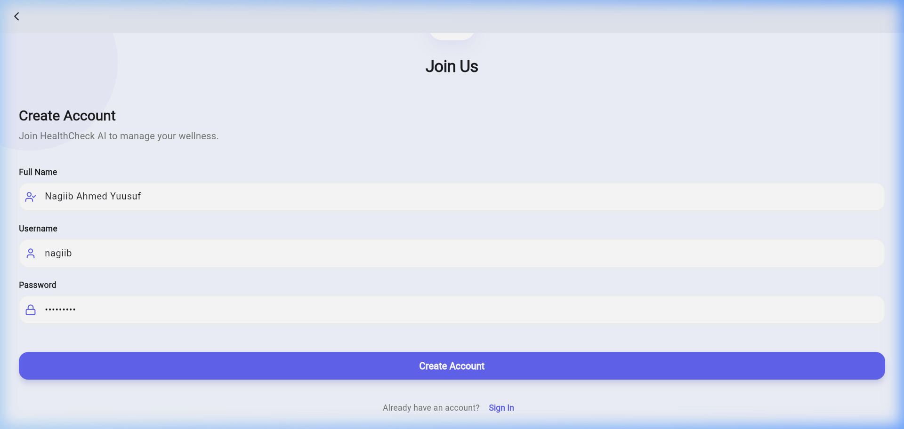

# Health Symptom Checker

Health Symptom Checker is a Flutter application designed to provide users with a clean, professional, and accessible medical interface to assess their health symptoms.

## 🚀 How to Run

1. Ensure you have Flutter SDK installed.
2. Clone this repository: `git clone https://github.com/aabdifataax4-star/Abdifataax-.git`
3. Navigate to the project directory: `cd Abdifataax-`
4. Install dependencies: `flutter pub get`
5. Run the application: `flutter run`

## 👥 Group Members (Group 1)

1. Cabdiraxmaan Axmed
2. Saalim Axmed Ibraahim
3. Cabdiqani Maxamed Xuseen
4. Axmed Xasan Axmed
5. Cabdirashiid Xuseen
6. Maxamed Yuusuf
7. Nagiib Ahmed Yuusuf

## 📸 Screenshots

Here is a preview of the Health Symptom Checker user interface:

